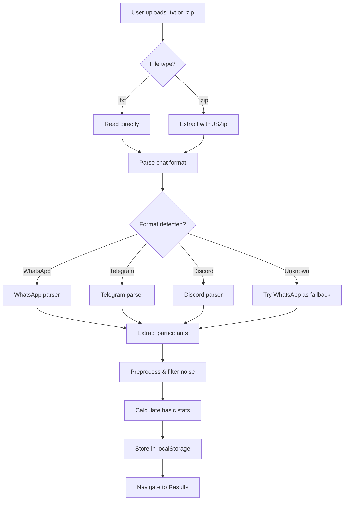
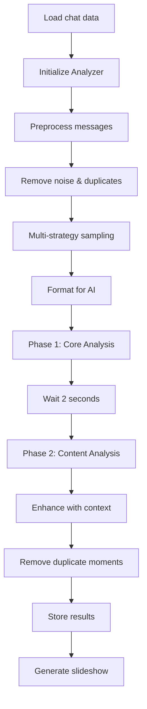

# 🎭 ChatReveal

**AI-Powered Group Chat Personality Analyzer**

ChatReveal uses advanced AI to analyze your WhatsApp, Telegram, or Discord chat exports and reveal hidden personalities, dynamics, and the funniest moments in your conversations—all processed securely in your browser and on serverless infrastructure.

🔗 **Live Demo**: [chatreveal.vercel.app](https://chatreveal.vercel.app)

---

## 📋 Table of Contents

- [Features](#-features)
- [How AI Powers ChatReveal](#-how-ai-powers-chatreveal)
- [Technical Architecture](#-technical-architecture)
- [Workflow & Techniques](#-workflow--techniques)
- [Privacy & Security](#-privacy--security)
- [Installation](#-installation)
- [Deployment](#-deployment)
- [Tech Stack](#-tech-stack)
- [Contributing](#-contributing)

---

## ✨ Features

### 🎭 **Personality Analysis**
- Individual personality profiles (style, tone, key traits)
- D&D moral alignments (Lawful Good, Chaotic Neutral, etc.)
- Group role identification (Therapist, Comedian, Drama Queen, etc.)

### 📊 **Chat Insights**
- Conversation topics & themes
- Group-specific vocabulary & slang
- Message statistics & patterns
- Relationship dynamics between members

### 🎪 **Fun Features**
- "Who Said This?" quiz with actual quotes
- Dankest/funniest messages with context
- Custom badges (Night Owl, LOL Spammer, etc.)
- Sentiment & vibe analysis

### 🔒 **Privacy First**
- 100% client-side file processing
- Serverless API with no data retention
- Files never uploaded to any server
- No authentication or tracking required

---

## 🤖 How AI Powers ChatReveal

ChatReveal uses **Groq's LLama 3.1 70B** model for ultra-fast, cost-effective chat analysis. Here's how the AI works:

### **1. Multi-Strategy Message Sampling**

Due to token limits, we can't send entire chats to the AI. Instead, we use three intelligent sampling strategies:

#### **Temporal Stratified Sampling (30%)**
- Divides chat into 5 time buckets (early, mid, late conversations)
- Ensures AI sees the evolution of conversations over time
- Captures how relationships and dynamics change

```javascript
// Example: 1000 messages → 5 buckets of 200 → Sample ~60 messages
const buckets = splitIntoTimeBuckets(messages, 5);
const samplesPerBucket = Math.floor(targetSamples * 0.3 / 5);
```

#### **Activity Hotspot Sampling (40%)**
- Identifies "hotspots" where conversations are most active
- Scores windows of 20 messages based on:
  - Number of unique participants (engagement)
  - Average message length (depth)
  - Presence of questions/humor markers
- Captures the most dynamic moments

```javascript
// High-engagement indicators
score += uniqueSenders * 10;
score += avgLength / 5;
if (hasQuestions) score += 5;
if (hasHumor) score += 3;
```

#### **Quality-Based Sampling (30%)**
- Ranks messages by "interesting" score:
  - Length (not too short, not too long)
  - Questions and engagement words
  - Humor indicators (haha, lol, emojis)
  - Emotional words (love, hate, crazy)
- Prioritizes messages that reveal personality

```javascript
// Quality scoring
score += lengthScore;
score += questionCount * 15;
score += humorIndicators * 4;
score += emotionalWords * 3;
```

### **2. Two-Phase AI Analysis**

#### **Phase 1: Core Analysis** (~400 messages, 2.5K tokens)
Focuses on understanding people and relationships:
- **Personalities**: Communication style, tone, key traits
- **Roles**: Who's the therapist, comedian, voice of reason?
- **Alignments**: D&D-style moral compass for each person
- **Relationships**: Closest pairs and their bond types

#### **Phase 2: Content Analysis** (~600 messages, 4K tokens)
Focuses on content and memorable moments:
- **Vocabulary**: Group-specific slang, inside jokes
- **Topics**: Main conversation themes (5-7 topics)
- **Quiz Questions**: 15-20 "Who Said This?" items
- **Dankest Messages**: 25-35 funniest/wildest moments
- **Sentiment**: Overall mood, energy, group vibe

### **3. Context Enhancement**

For dankest messages, we extract surrounding messages to provide context:

```javascript
// Example: If Alice said "that's what she said"
// We show:
// Bob: "this is really hard"
// Charlie: "yeah it's so big"
// Alice: "that's what she said" ← target
// Bob: "ALICE NO" ← reaction
```

### **4. AI Prompt Engineering**

Our prompts are carefully crafted to:
- **Be specific**: Exact JSON structure requested
- **Focus on humor**: "Find the FUNNIEST, WILDEST moments"
- **Avoid duplicates**: Explicit instructions to check for repeats
- **Set constraints**: Word counts, score ranges, categories
- **Request brevity**: "CONCISE analysis" to save tokens

Example prompt snippet:
```
Find the ABSOLUTE FUNNIEST, WILDEST, and MOST UNHINGED moments.
For EACH message:
- Category: "Savage Roast" / "Dark Humor" / "Random/WTF" / ...
- Message: EXACT full quote (10-150 chars) - MUST BE DIFFERENT from all others
⚠️ CRITICAL: NO message text can appear more than once
```

---

## 🏗️ Technical Architecture

### **Frontend (React + Vite)**
```
┌─────────────────────────────────────┐
│  User uploads chat file (.txt/.zip) │
└──────────────┬──────────────────────┘
               │
               ▼
┌─────────────────────────────────────┐
│  Client-side parsing & preprocessing │
│  • Detect format (WhatsApp/Telegram) │
│  • Extract messages & participants   │
│  • Calculate basic stats             │
└──────────────┬──────────────────────┘
               │
               ▼
┌─────────────────────────────────────┐
│  Smart message sampling (3 strategies)│
│  • Temporal (30%)                    │
│  • Hotspot (40%)                     │
│  • Quality (30%)                     │
└──────────────┬──────────────────────┘
               │
               ▼
┌─────────────────────────────────────┐
│  Format for AI (compact tokens)     │
│  • Truncate names to 8 chars        │
│  • Limit message length to 100 chars│
└──────────────┬──────────────────────┘
               │
               ▼
        [API Request]
```

### **Backend (Vercel Serverless)**
```
┌─────────────────────────────────────┐
│  /api/groq serverless function      │
│  • Receives formatted messages      │
│  • Manages API key rotation         │
│  • Handles rate limiting            │
└──────────────┬──────────────────────┘
               │
               ▼
┌─────────────────────────────────────┐
│  Groq API (LLama 3.1 70B)           │
│  • Phase 1: Core Analysis           │
│  • Phase 2: Content Analysis        │
│  • Temperature: 0.4-0.7             │
│  • Max tokens: 2.5K-4K              │
└──────────────┬──────────────────────┘
               │
               ▼
┌─────────────────────────────────────┐
│  Response processing                │
│  • Clean JSON from markdown         │
│  • Validate structure               │
│  • Remove duplicates                │
└──────────────┬──────────────────────┘
               │
               ▼
        [Return to Frontend]
```

### **Why Serverless?**
1. **Security**: API keys never exposed to client
2. **Scalability**: Auto-scales with demand
3. **Cost**: Only pay for actual usage
4. **CORS**: No cross-origin issues
5. **Rate Limiting**: Centralized key rotation

---

## 🔄 Workflow & Techniques

### **File Processing Pipeline**



### **AI Analysis Pipeline**



### **Rate Limit Handling**

We implement exponential backoff with retry logic:

```javascript
// Retry up to 5 times with increasing delays
for (let attempt = 0; attempt < 5; attempt++) {
  try {
    return await callAPI();
  } catch (error) {
    if (error.status === 429) {
      // Rate limited - wait and retry
      const delayMs = Math.min(1000 * Math.pow(2, attempt), 10000);
      await sleep(delayMs);
      continue;
    }
    throw error;
  }
}
```

### **Token Optimization**

We maximize information while minimizing tokens:

| Technique | Token Savings |
|-----------|---------------|
| Truncate names to 8 chars | ~40% on names |
| Limit messages to 100 chars | ~50% on content |
| Remove media tags | ~10% overhead |
| Smart sampling vs full chat | ~95% reduction |

**Example**: 10,000 message chat → ~350 messages sent to AI (96.5% reduction)

---

## 🔒 Privacy & Security

### **Client-Side Processing**
- Files are parsed entirely in your browser using JavaScript
- No uploads to any server during parsing
- All data stays in `localStorage` (browser memory)

### **Serverless API Design**
- API receives only **anonymized message samples**
- No file storage or logging on server
- Stateless functions that terminate after response
- API keys managed securely in environment variables

### **Data Flow**
```
Your Device → Browser Parser → Sampled Messages → Serverless API → Groq AI
                                                              ↓
                              Results ← Response Processing ←
```

### **What We DON'T Store**
- ❌ Your original chat files
- ❌ Full conversation history
- ❌ User identification data
- ❌ Any messages beyond the analysis session

### **What IS Processed**
- ✅ Selected message samples (350-600 out of thousands)
- ✅ First names only (truncated to 8 characters)
- ✅ Message text (truncated to 100 characters)
- ✅ Timestamps (for context only)

---

## 📦 Installation

### **Prerequisites**
- Node.js 18+ and npm/yarn
- Groq API key(s) ([Get free key](https://console.groq.com))

### **Local Development**

1. **Clone the repository**
```bash
git clone https://github.com/yourusername/chatreveal.git
cd chatreveal
```

2. **Install dependencies**
```bash
npm install
```

3. **Set up environment variables**

Create `.env` file:
```env
# Required: At least one Groq API key
GROQ_API_KEY_1=gsk_...
GROQ_API_KEY_2=gsk_...
GROQ_API_KEY_3=gsk_...

# Optional: For enhanced rate limit handling
NODE_ENV=development
```

4. **Run development server**
```bash
npm run dev
```

5. **Open browser**
```
http://localhost:5173
```

### **Project Structure**
```
chatreveal/
├── api/
│   └── groq.js                 # Serverless API endpoint
├── src/
│   ├── components/
│   │   └── slideshow/          # Results slideshow UI
│   ├── pages/
│   │   ├── UploadPage.jsx     # File upload & parsing
│   │   └── ResultsPage.jsx    # AI analysis trigger
│   ├── utils/
│   │   ├── Llm.js             # WhatsAppAnalyzer class
│   │   ├── badgeCalculation.js # Badge logic
│   │   └── getAISlides.js     # Slide generation
│   └── App.jsx
├── public/
├── package.json
└── vercel.json                 # Vercel config
```

---

## 🚀 Deployment

### **Deploy to Vercel (Recommended)**

1. **Push to GitHub**
```bash
git init
git add .
git commit -m "Initial commit"
git remote add origin https://github.com/yourusername/chatreveal.git
git push -u origin main
```

2. **Import on Vercel**
- Go to [vercel.com/new](https://vercel.com/new)
- Import your GitHub repository
- Vercel auto-detects Vite configuration

3. **Add environment variables**
In Vercel dashboard → Settings → Environment Variables:
```
GROQ_API_KEY_1 = gsk_...
GROQ_API_KEY_2 = gsk_...
GROQ_API_KEY_3 = gsk_...
```

4. **Deploy**
```bash
# Or use Vercel CLI
npm install -g vercel
vercel --prod
```

Your app will be live at: `https://your-project.vercel.app`

### **Alternative: Deploy to Netlify**

1. **Install Netlify CLI**
```bash
npm install -g netlify-cli
```

2. **Build and deploy**
```bash
npm run build
netlify deploy --prod
```

3. **Add environment variables** in Netlify dashboard

**Note**: You'll need to adapt the serverless function format for Netlify Functions.

---

## 🛠️ Tech Stack

### **Frontend**
- **React 18** - UI framework
- **Vite** - Build tool & dev server
- **Tailwind CSS** - Utility-first styling
- **Lucide React** - Icon library
- **JSZip** - ZIP file extraction

### **Backend**
- **Vercel Serverless Functions** - API endpoints
- **Node.js 18+** - Runtime environment

### **AI/ML**
- **Groq Cloud** - AI inference platform
- **LLama 3.1 70B** - Language model
- **Custom sampling algorithms** - Token optimization

### **Supporting Libraries**
- **React Router** - Navigation
- **LocalStorage API** - Client-side data persistence

---

## 🤝 Contributing

Contributions are welcome! Here's how:

1. **Fork the repository**
2. **Create a feature branch**
   ```bash
   git checkout -b feature/amazing-feature
   ```
3. **Commit your changes**
   ```bash
   git commit -m "Add amazing feature"
   ```
4. **Push to branch**
   ```bash
   git push origin feature/amazing-feature
   ```
5. **Open a Pull Request**

### **Areas for Contribution**
- 🌐 Add support for more chat platforms (iMessage, Slack)
- 🎨 Improve UI/UX design
- 🤖 Enhance AI prompts for better insights
- 📊 Add more statistical analysis
- 🌍 Internationalization (i18n)
- 🧪 Add test coverage

---

## 📄 License

This project is licensed under the MIT License - see the [LICENSE](LICENSE) file for details.

---

## 🙏 Acknowledgments

- **Groq** for providing blazing-fast AI inference
- **Meta** for the LLama model series
- **Vercel** for serverless infrastructure
- The open-source community for amazing tools

---

## 📞 Support

- **Issues**: [GitHub Issues](https://github.com/yourusername/chatreveal/issues)
- **Discussions**: [GitHub Discussions](https://github.com/yourusername/chatreveal/discussions)
- **Email**: support@chatreveal.com

---

## 🎯 Roadmap

- [ ] Add support for iMessage exports
- [ ] Implement data export (PDF/PNG reports)
- [ ] Add custom AI model selection
- [ ] Create browser extension for direct exports
- [ ] Multi-language support
- [ ] Mobile app version

---

**Made with ❤️ by the ChatReveal team**

*Privacy-focused • AI-powered • Open source*